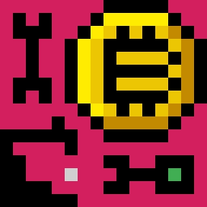

# ★MyFaucetBot★ - Ultimate Bitcoin Faucet Bot.

* [https://mydicebot.com](https://mydicebot.com)
* [MyFaucetBot](https://mydicebot.com) is World #1 Cross-Platform Faucet Bot.
* Multiple platforms are supported, including __Windows, Mac, Linux__.
